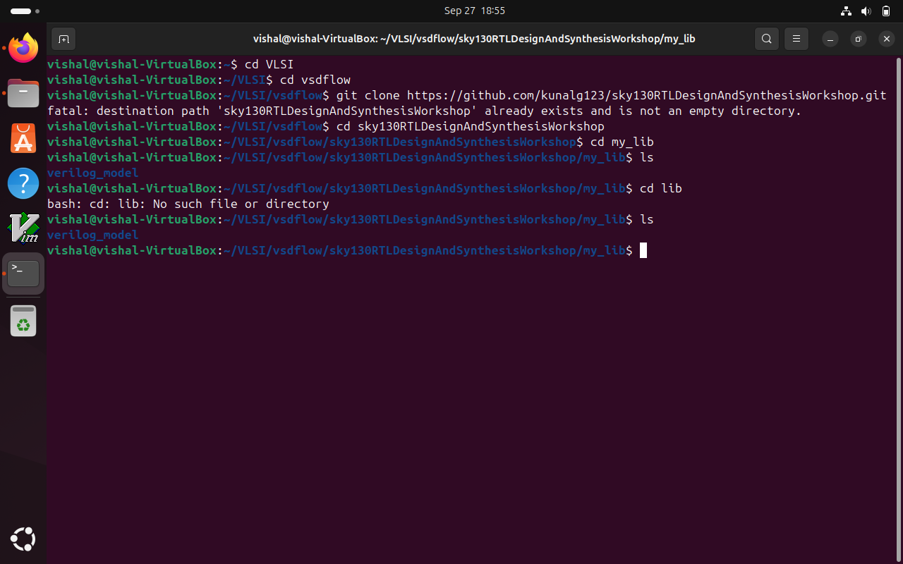

As we can see i have already created a directory called VLSI and vsdflow inside it. after this git repository called "sky130RTLDesignAndSynthesisWorkshop" has been cloned into the directory successfully 
