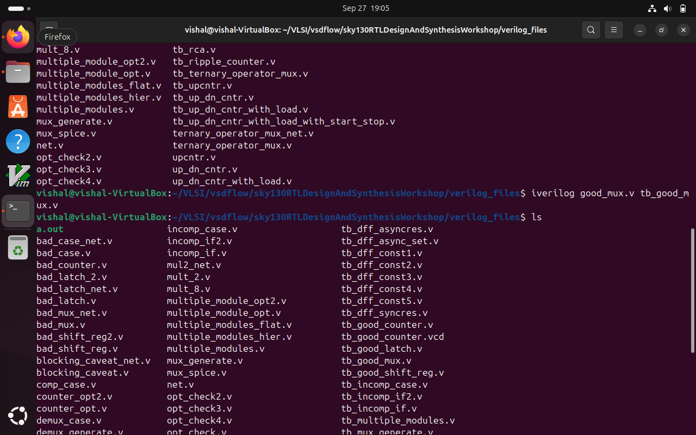
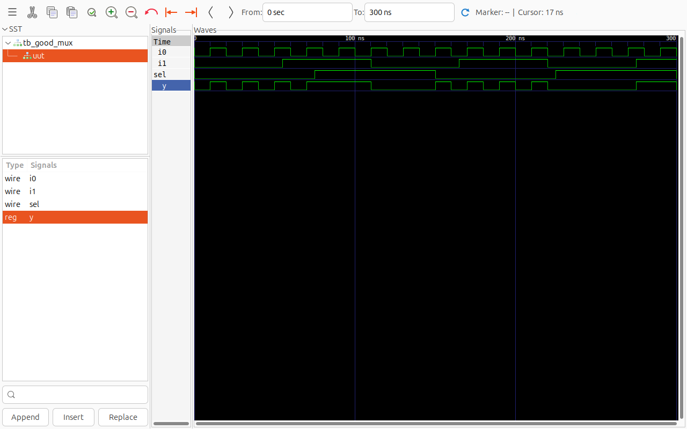
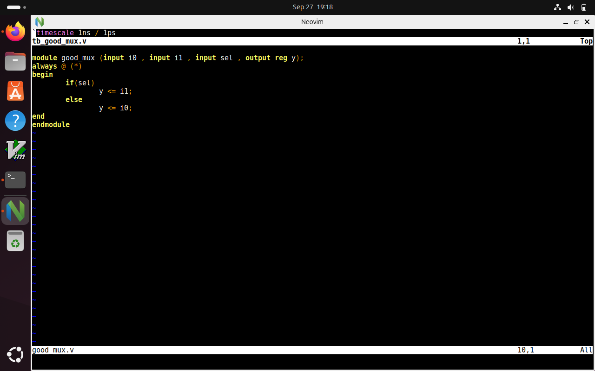
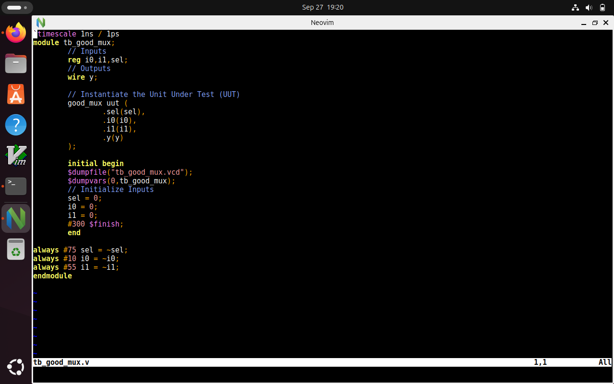

# LAB2
In this lab, i have simulated a multiplexer using RTL verilog code and a test bench that are already present in the verilog  files in the directory created in the previous lab. 

"iverilog" has created a "a.out" file as seen in the image. It is a compiled binary executable of the design plus testbench simulation code. Now, As the simulation runs, it generates a waveform dump file, usually a VCD (Value Change Dump) file, here its named as "good_mux.v", which records signal changes over time.

The waveform created is using GTKwave to show  the simulation of a MUX from the vcd file generated.

 

This shows the RTL verilog design code for implementing a 2:1 MUX.

This shows the test bench for the same module written above.
