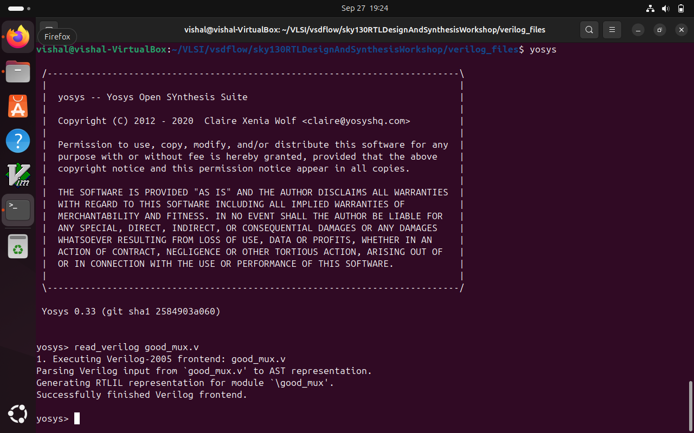
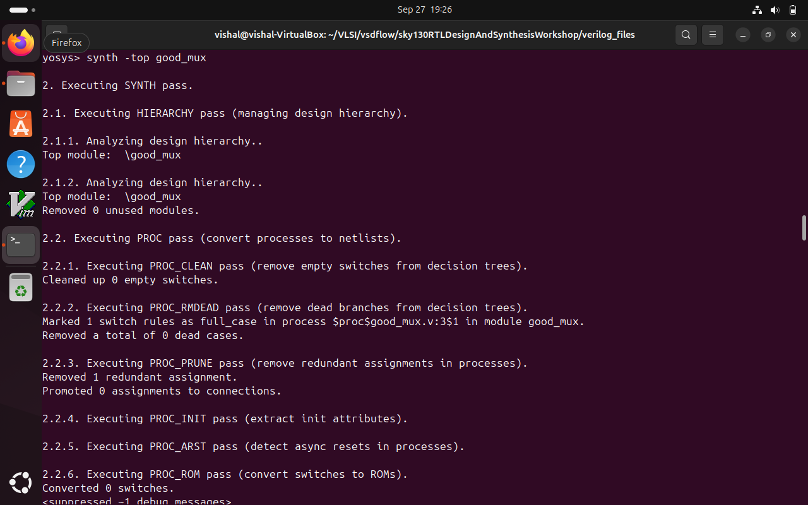

In this Lab we are going to use yosys to combine RTL verilog and .lib extensions to create a netlist.
# .lib File
A .lib file is a text file that contains timing and power information of standard cells used in digital chip design. It helps synthesis and timing analysis tools understand the delay, setup, hold times, and power consumption of each cell so they can optimize the circuit correctly.
# Netlist
A netlist is a file that describes the connection of all the gates and components in a digital design. It lists which pins of which cells are connected to each other, representing the circuit after synthesis but before physical layout.

According to this image we have to read both liberty files and verilog files first.

Here we are using a command synth -top <top_module_name>, synth: Runs the synthesis command to convert RTL to a gate-level netlist, whereas -top <module>: Specifies which module in your Verilog code is the top-level module to start synthesis with.

Reason:

Verilog source files may contain multiple modules.
The top-level module is the one that instantiates all other modules and interfaces with input/output.
Specifying -top tells the synthesizer exactly which module to consider as the design entry point.

